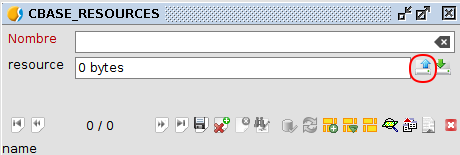

**EN CONSTRUCCION**
























## {{ page.title }}

### Descripción

Este proceso carga la leyenda ```${LEYENDA_NAME}``` (${LEYENDA_LINK}) como recurso en el 
repositorio ```${REPONAME}``` (REPONAME) y la asigna a la capa ```${TABLE_NAME}``` (${TABLE_LINK}).

### Datos de entrada

1. ${check} Archivo de datos: ```${TABLE_NAME}``` (${TABLE_LINK}). Capa a usar en este test. 

2. ${check} Archivo con leyenda predefinida: ```${LEYENDA_NAME}``` (${LEYENDA_LINK}). 
   Leyenda predefinida para la capa ```${TABLE_NAME}``` (${TABLE_LINK}). 

3. ${check} **REPONAME**=```${REPONAME}```. Nombre de la conexión y del repositorio.

4. ${check} **WCNAME**=```${WCNAME}```. Nombre de la copia de trabajo sobre la que se realiza el 
   proceso de registrar el recurso.

5. ${check} **WCNAME2**=```${WCNAME2}```. Nombre de la copia de trabajo sobre la que se realiza el checkout 
   de la capa con la leyenda asignada.

6. ${check} **CATEGORY**=```${CATEGORY}```. Categoria a asignar la capa al hacer checkout.

7. ${check} **USER**=```${USER}```. Identificador de usuario.

8. ${check} **PASSWORD**=```${PASSWORD}```. Contraseña de usuario.

### Prerrequisitos

1. ${check} Un gvSIG desktop instalado y funcional cuya versión sea la indicada en el plan de pruebas.

2. ${check} El complemento de VCSGis debe estar instalado y activo.

3. ${check} El caso de prueba 
   [VC00SY00CP002, "Commitar una capa nueva (repositorio remoto en H2 con autorización)"](../../SY00/CP002/testVC00SY00CP002.md),
   ha pasado sin errores.
   
### Pasos

1. ${check} Si acaba de ejecutar el caso de pruebas (hace menos de 1 hora) VC00SY00CP002,
    "Commitar una capa nueva (repositorio remoto en H2 con autorización)"
    y no ha cerrado gvSIG, continúe con el paso 2. Si no, ejecútelo antes de continuar.
    
2. ${check} Asegúrese de estar en la aplicación gvSIG Desktop ```cliente``` puesto que en primer lugar va a crear 
   una tabla de recursos que posteriormente va a rellenar con la leyenda de la capa. Tras esto va a hacer commit 
   de dicha información al repositorio.

3. ${check} Proceda a crear la tabla de recursos. Para ello pulse el menú "Herramientas".
   
4. ${check} Pulse la opción "VCSGis" del desplegable anterior.

5. ${check} Seleccione la opción "Administración".

6. ${check} Pulse del desplegable la opción "Crear tabla de recursos".

7. ${check} Se presenta un cuadro de diálogo titulado "Crear tabla de recursos".
     
8. ${check} En el campo "Copia de trabajo" seleccione ```${WCNAME}``` (WCNAME). Esta copia de trabajo tiene 
   que disponer de la capa, ```${TABLE_NAME}``` (${TABLE_LINK}), a la cual se desea asignar el recurso.

9. ${check} En el campo "Nombre de tabla" especifique el nombre ```CBASE_RESOURCES``` puesto que la 
   capa ```${TABLE_NAME}``` (${TABLE_LINK}) presenta la categoría ```${CATEGORY}``` (CATEGORY)

10. ${check} Pulse el botón "Aceptar".

11. ${check} Con la tabla de recursos ```CBASE_RESOURCES``` ya creada hay que introducir esta el fichero
    ```${LEYENDA_NAME}``` (${LEYENDA_LINK}). Abra la tabla de recursos ```CBASE_RESOURCES```. Siga los pasos de 
    [Abrir tabla de base de datos](../../PROC/011/procVC00PROC011.html?BBDD=${REPONAME}&TABLENAME=$CBASE_RESOURCES)

12. ${check} Una vez abierta la tabla y estando esta activa se procede a añadir en esta un nuevo registro. Para ello 
    seleccione "Tabla" en el menú de gvSIG Desktop.

13. ${check} Seleccione del despeglable anterior la opción "Show form". 

14. ${check} Como resultado se genera una nueva ventana que muestra el formulario asociado a la tabla de recursos.

15. ${check} Para registrar cambios en esta hay que iniciar la edición. Para iniciar la edición pulse el icono con la
   etiqueta "Comenzar edición". Los iconos se muestran en la zona inferior de la ventana y el de comenzar edición se
   encuentra en la zona media de estos.

16. ${check} La acción anterior habilita una serie de iconos.

17. ${check} Pulse el icono con la etiqueta "Nuevo" recientemente habilitado.

19. ${check} Como consecuencia de lo anterior, algunos de los campos de la página actual del formulario se muestran
    sin datos a la espera de la nueva información.

19. ${check} Indroduce el nombre del nuevo recurso, ```${LEYENDA_NAME}``` en el campo correspondiente.

20. ${check} Localiza el campo "Recurso" y de los dos iconos adyacentes a este pulse el que presenta una flecha
    ascendente de color azul.

    

21. ${check} Se presenta un cuadro de diálogo para seleccionar un fichero. 
    Seleccione el correspondiente a ```${LEYENDA_NAME}``` (${LEYENDA_LINK}).
     
22. ${check} Pulse en el boton "Abrir".

23. ${check} De vuelta en el formulario de la tabla de recursos ```CBASE_RESOURCES``` el campo "Recursos" tiene
    que estar relleno con el tamaño del archivo ```${LEYENDA_NAME}```.

24. ${check} Pulse el icono con la etiqueta "Guardar".

25. ${check} Para terminar el proceso y trás guardar cambios hay que terminar la edición. Para terinar 
    la edición pulse el icono con la etiqueta "Terminar edición". Este se encuentra la zona media de los iconos. 

26. ${check} Cierre el formulario.

27. ${check} Cierre la tabla en cuestión

28. ${check} Minimice la aplicación gvSIG Desktop ```cliente````.

29. ${check} Active la aplicación gvSIG Desktop ```servidor```. A partir de ahora va a configurar el servidor para 
    registrar el recurso a la capa ```${TABLE_NAME}``` (${TABLE_LINK}).

30. ${check} Abra la tabla ```VCSGISREPO_ENTITIES``` de este. Siga los pasos de 
    [Abrir tabla de base de datos](../../PROC/011/procVC00PROC011.html?BBDD=${REPONAME}&TABLENAME=$VCSGISREPO_ENTITIES) 

31. ${check} Una vez abierta la tabla y estando esta activa se procede a asignar el recurso a la entidad. Para ello 
    seleccione "Tabla" en el menú de gvSIG Desktop.

32. ${check} Seleccione del despeglable anterior la opción "Show form". 

33. ${check} Como resultado se genera una nueva ventana que muestra el formulario asociado a la tabla 
    de entidades.

34. ${check} Para registrar cambios en esta hay que iniciar la edición. Para iniciar la edición pulse el icono con la
    etiqueta "Comenzar edición". Los iconos se muestran en la zona inferior de la ventana y el de comenzar edición se
    encuentra en la zona media de estos.

35. ${check} La acción anterior habilita una serie de iconos.

36. ${check} Seleccione con ayuda de los iconos "Anterior" y "Siguiente" la página del formulario de la 
    entidad ```${TABLE_NAME}``` (${TABLE_LINK}).

37. ${check} Localice el campo "Resources" y rellenelo con el nombre de la tabla de recursos ```CBASE_RESOURCES```.

38. ${check} Pulse el icono con la etiqueta "Guardar".

39. ${check} Para terminar el proceso y trás guardar cambios hay que terminar la edición. Para terminar la edición pulse 
    el icono con la etiqueta "Terminar edición". Este se encuentra la zona media de los iconos. 

40. ${check} Cierre el formulario.

41. ${check} Cierre la tabla en cuestión

42. ${check} Minimice la aplicación gvSIG Desktop ```servidor````.

43. ${check} Active la aplicación gvSIG Desktop ```cliente```. A partir de ahora va a comprobar que la capa
    ```${TABLE_NAME}``` (${TABLE_LINK}) dispone de la leyenda como recurso asociado. Para ello hay que realizar
    un checkout de esta.

44. ${check} Cierre la aplicación gvSIG Desktop ```cliente```.

45. ${check} Compruebe que no exista el fichero:
   * ```${TMPFOLDER}/${WCNAME2}.mv.db``` (*TMPFOLDER*/*WCNAME2*.mv.db).
   En caso de que exista elimínelo.

46. ${check} Abra la aplicación gvSIG Desktop ```cliente```.

47. ${check} Inicialice una nueva copia de trabajo para ello siga los pasos de 
   [Inicializacion de una copia de trabajo (repositorio remoto en H2 con autorización)](../../PROC/008/procVC00PROC008.html?TMPFOLDER=${TMPFOLDER}&REPONAME=${REPONAME}&WCNAME=${WCNAME2})

48. ${check} Asegúrese de que la vista que se ha creado al arrancar gvSIG se encuentra en "EPSG:4326", 
   de no ser asi cámbie la proyección de la vista.

49. ${check} Seleccione la opción de menú "Herramientas"

50. ${check} Del desplegable surgido en la acción anterior seleccione la opción "VCSGis".

51. ${check} Del desplegable surgido en la acción anterior pulse la opción "Obtener copia local (checkout)" 

52. ${check} Tras lo anterior, se muestra la ventana con el título "Obtener copia local (checkout)".

53. ${check} Siga los pasos de 
    [Obtención de una copia local (checkout)](../../PROC/006/procVC00PROC006.html?WCNAME=${WCNAME2}&TABLENAME=${TABLE_NAME}&USER=${USER}&PASSWORD=${PASSWORD})

54. ${check} Cierre el cuadro de diálogo "Obtener copia local (checkout)".

55. ${check} En la vista se habrá añadido la capa```${TABLE_NAME}``` (TABLE_NAME) con la 
    leyenda ```${LEYENDA_NAME}```.


### Resultado esperado



### Reportar fallo




